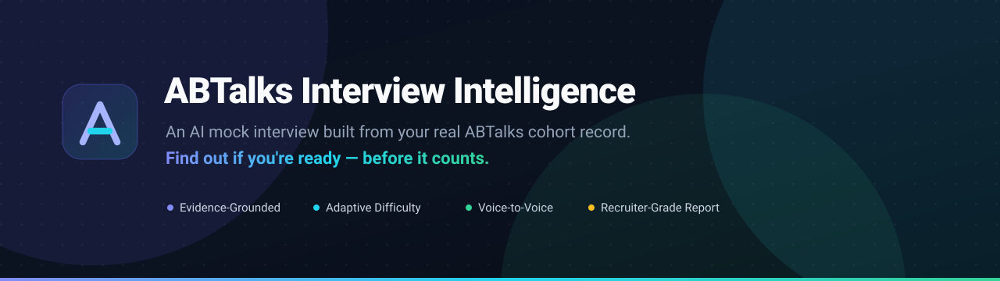
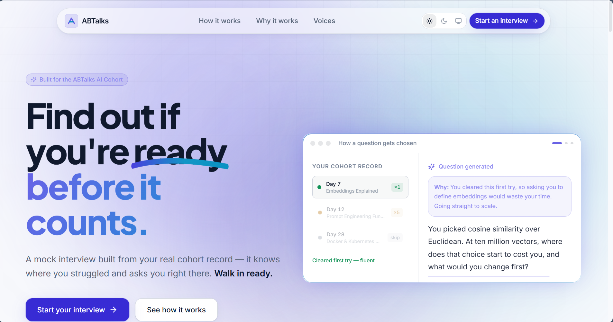
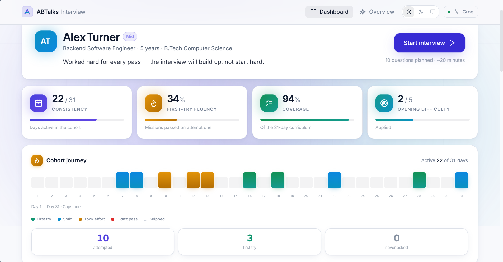
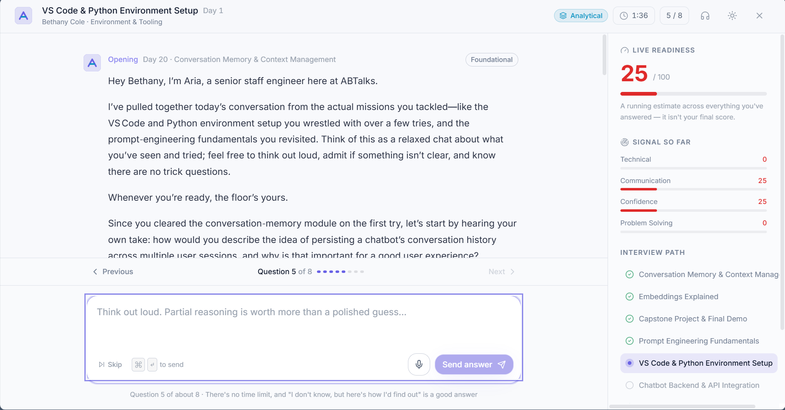
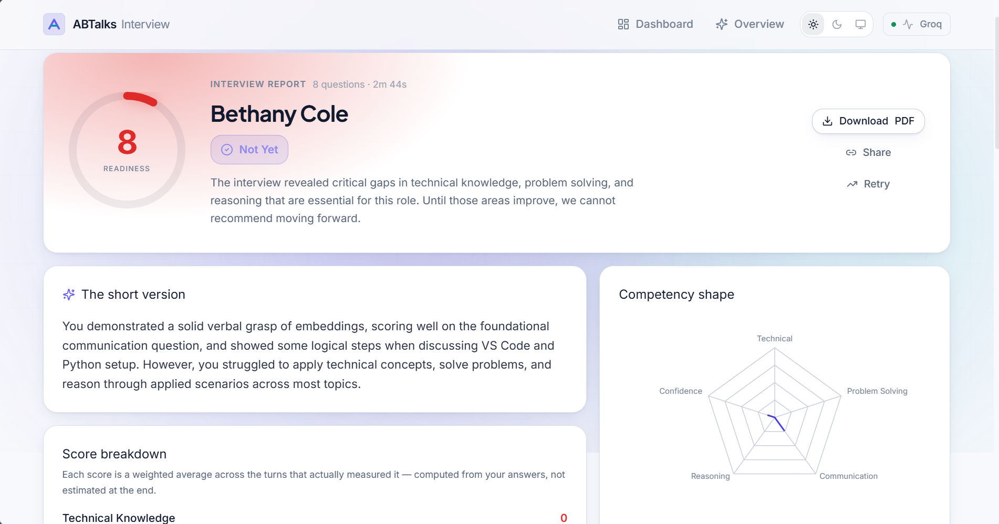
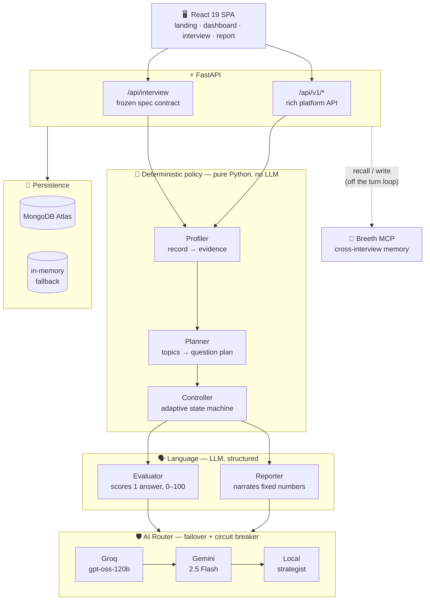
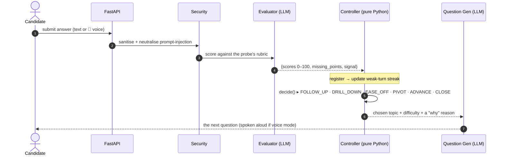
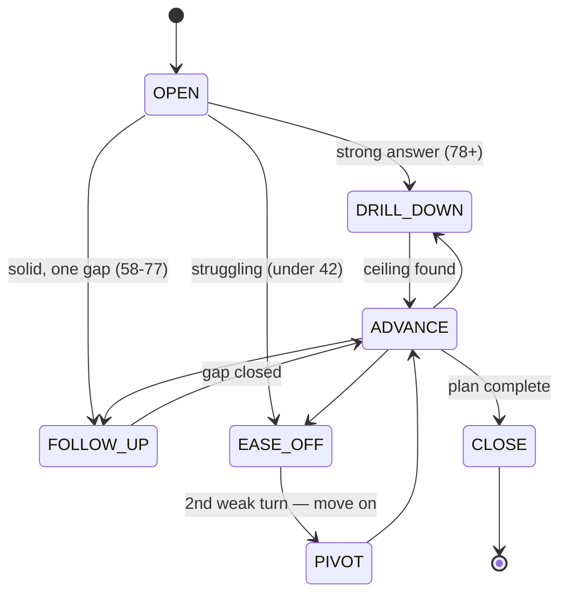
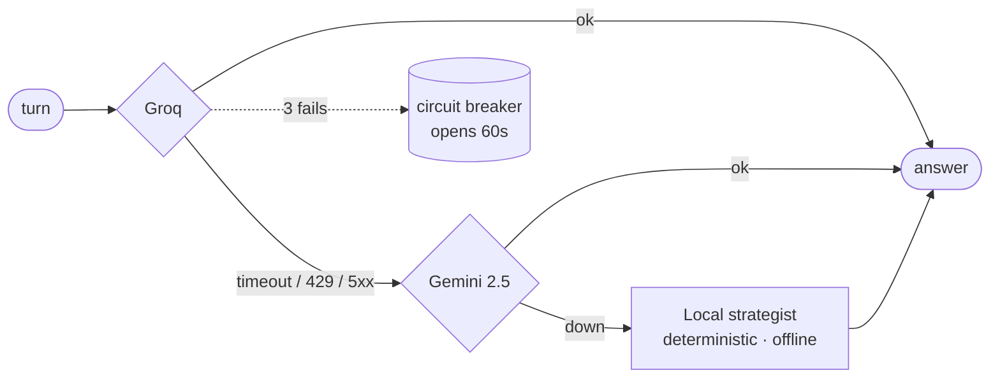

<p align="center">
  
</p>

<p align="center">
  <a href="#-quickstart"></a>
  
  
  
</p>

<p align="center">
  <b>An AI that runs a real, adaptive technical interview — grounded in the candidate's actual 31-day ABTalks cohort record.</b><br>
  <sub>It knows what you built, where you struggled, and what you skipped — and questions you exactly there.</sub>
</p>

<p align="center">
  <a href="#-the-idea-in-one-table">The Idea</a> ·
  <a href="#-architecture">Architecture</a> ·
  <a href="#-how-a-question-gets-chosen">The Engine</a> ·
  <a href="#-quickstart">Quickstart</a> ·
  <a href="#-the-api-contract">API</a> ·
  <a href="#-beyond-the-spec">Voice &amp; Memory</a>
</p>

---

## 🎯 The problem

The ABTalks AI Cohort is a 31-day enterprise AI engineering program — RAG, vector search, prompt
engineering, agents, MCP, deployment. Learners finish it having *built* real systems.

But finishing a course and being able to **explain your engineering decisions under pressure** are
two different things. A completion certificate measures attendance. An interview measures thinking.
**Nothing in between tells a student whether they're actually interview-ready.**

This bridges that gap — not with a generic question bank, but with an interviewer that has *read
your record*.

---

## 💡 The idea, in one table

Most teams will hand an LLM the candidate JSON and say *"be an interviewer."* That demos on turn 3
and falls apart on turn 9 — repeated questions, drifting difficulty, scores that are vibes.

Our whole product starts from a different reading of the data:

> **`candidates.json` is not a résumé. It is *evidence*.** And the single most important field is
> **`attempts`.**

| Signal in the record | What it actually means | What the interview does |
|---|---|---|
| `passed · attempts: 1` | Genuine fluency | **Probe deep.** Definitions waste their time — go to trade-offs & scale. |
| `passed · attempts: 2–3` | Solid ground | Probe normally — apply it, compare options. |
| `passed · attempts: 4–5` | Ground it out | **The highest-value question in the interview.** Did the model *land*, or was the procedure memorised? |
| `passed: false` | An honest gap | Diagnose gently. A learning signal, **never a gotcha.** |
| `skipped: true` | Never saw the material | **Never asked about. Ever. Enforced in code.** |

That last row is the product in miniature. A ChatGPT wrapper asks Wendy Foster (Marketing Manager)
about the Kubernetes she skipped, and she feels stupid. **We exclude skipped material from the
question pool as a data structure — before any prompt is built — and surface it in her learning
roadmap instead.** Same fact, opposite treatment, because the two contexts have opposite ethics.

<sub>There's a unit test that sweeps all 20 candidates and asserts this can never happen.</sub>

---

## 🖼️ See it in action

> 📸 **Screenshots live in [`docs/screenshots/`](./docs/screenshots).** Capture the five routes
> below at 390px + desktop and drop them in — the grid renders automatically.

<table>
<tr>
<td width="50%"><br><sub><b>Landing</b> — trust in five seconds</sub></td>
<td width="50%"><br><sub><b>Dashboard</b> — pick a candidate profile</sub></td>
</tr>
<tr>
<td><br><sub><b>Interview</b> — immersive, adaptive, voice-enabled</sub></td>
<td><br><sub><b>Report</b> — auditable, recruiter-grade</sub></td>
</tr>
</table>

---

## 🧠 Architecture

**The one decision that defines this project:**

> **Interview *policy* is deterministic Python. Only *language* is the LLM.**

Which topic, which difficulty, which competency, whether to follow up, when to stop — all decided in
plain, testable Python *before* a prompt is built. The model is handed a decision and asked to phrase
it well. This is why the interview **cannot repeat itself, cannot drift off-syllabus, and cannot ask
about skipped material** no matter what the model does.



### The five engines

| Engine | Kind | Responsibility |
|---|---|---|
| **Profiler** | pure fn | Reads the mission log into an evidence profile — fluency, friction, a *domain-split* read (classic-eng vs AI-native), the eligible-topic pool. |
| **Planner** | pure fn | Allocates topics to question slots *before the interview starts* → no repeats, guaranteed competency coverage, a difficulty arc. |
| **Controller** | pure fn | The adaptive state machine. Reads the last score, returns the next move **+ a human-readable reason**. |
| **Evaluator** | LLM | Scores one answer against a rubric into **bounded 0–100 integers** (Pydantic-validated). |
| **Reporter** | LLM + math | Aggregates scores *arithmetically*, then the LLM narrates numbers it cannot change. |

---

## 🎯 How a question gets chosen

Note the ordering: the **decision is made before the question is generated**, and the generator only
phrases it. The model never chooses what happens next.



---

## 🔀 The adaptive controller

This is the headline claim — *"it adapts like a real interviewer"* — and because it's a pure
function, it's the part we can actually **unit-test and explain.** Every transition ships a sentence
to the UI, so the candidate can see *why* the difficulty just moved.



Two decisions worth calling out: the **last question is deliberately easier** (a candidate should
leave having answered something well), and **two weak turns pivot rather than grind** — a non-answer
(*"I don't know"*) doesn't even count toward that streak, because punishing honesty is exactly the
behaviour the rubric rewards.

---

## 🛡️ It cannot break

A judge on flaky wifi is the single most likely failure moment. So the AI layer has **three tiers**,
not two, and the interview *cannot die* mid-session.



The failover is **invisible to the candidate** — same response shape whoever serves it. Because the
*policy* is deterministic, even the offline local tier still advances the interview correctly, avoids
repeats, and produces a scored report. **The repo also runs with zero API keys** — a reviewer who
can't start it scores it zero, so we made that impossible.

<sub>Verified live: a single interview served turn 1 from Groq (1.3s) and turn 2 from Gemini (4.2s) — the failover fired and nobody noticed.</sub>

---

## 🚀 Quickstart

**Zero configuration required.** With no keys and no database it boots, serves the full API, and runs
complete interviews on the deterministic local strategist. Add keys for real model quality.

### Backend

```bash
cd backend
python -m venv .venv && .venv\Scripts\activate      # macOS/Linux: source .venv/bin/activate
pip install -r requirements.txt
cp .env.example .env                                 # optional — add keys here
uvicorn app.main:app --reload --port 8000
```

### Frontend

```bash
cd frontend
npm install
npm run dev            # → http://localhost:5173
```

Vite proxies `/api` to port 8000 — no CORS setup, no backend URL baked into the bundle.

<details>
<summary><b>Optional configuration</b> (all keys optional — see <code>backend/.env.example</code>)</summary>

| Variable | Purpose |
|---|---|
| `GROQ_API_KEY` | Primary model (`gpt-oss-120b`) — the cohort teaches Groq on Day 11 |
| `GEMINI_API_KEY` | Fallback (Gemini 2.5 Flash) |
| `MONGODB_URI` / `MONGO_URI` | Persist sessions & reports (empty → in-memory) |
| `BREETH_API_KEY` | Longitudinal cross-interview memory (optional) |

</details>

---

## 🔌 The API contract

The hackathon spec is served **byte-for-byte** and frozen — and by the *same engine* our own frontend
drives, so every interview we run exercises the graded contract.

```jsonc
POST /api/interview
// start
{ "sessionId": "abc-123", "candidate": { …candidate.json } }  →  { "reply": "…", "done": false }
// turn
{ "sessionId": "abc-123", "message": "…" }                    →  { "reply": "…", "done": false }
// completion
→ { "reply": "…", "done": true,
    "feedback": { "summary": "…", "strengths": [], "gaps": [], "next": [] } }
```

<sub>Two behaviours the spec leaves open, handled the careful way: <b>start is idempotent</b> (a retried request replays rather than wiping the session), and the opening reply carries the greeting <b>and</b> the first question — a greeting alone leaves nothing to answer.</sub>

---

## ✅ Every requirement — proven, not claimed

Driven live through `POST /api/interview`:

| PS2 requirement | Status |
|---|---|
| Conversational, multi-turn interview | ✅ |
| ≥ 8 questions across ≥ 4 curriculum days | ✅ **verified for all 20 candidates** |
| Follow-ups based on previous answers | ✅ `FOLLOW_UP` / `DRILL_DOWN` / `EASE_OFF` |
| Context maintained via `sessionId` | ✅ |
| Structured feedback `{summary, strengths, gaps, next}` | ✅ |
| Required HTTP endpoint & response shape | ✅ exact |
| *"A real interview, not a questionnaire"* | ✅ difficulty moves `2→3→4→5→4→3` live |

```bash
cd backend && .venv\Scripts\python -m pytest tests/ -q     # 33 passed
```

The suite is **hermetic** (blanks all credentials, asserts offline) and covers the spec contract
end-to-end plus every fairness guarantee — including the sweep proving **no candidate can ever be
asked about material they skipped.**

---

## 🌟 Beyond the spec

Three things the challenge doesn't require — and most teams won't have.

### 🎤 Voice-to-voice interviewing
The interviewer **speaks each question aloud** and you **answer by talking.** Built entirely on the
browser's Web Speech API, so it costs the backend nothing — the existing text endpoint just feeds
text in and reads text out. Speech is **review-then-send** (recognition mishears; auto-submitting a
misheard answer in a high-stakes moment is unacceptable), with barge-in and a natural neural voice.
*PS2 lists voice as out of scope — so it's a pure differentiator.*

### 🧬 Longitudinal memory (Breeth MCP)
We **inspected the Breeth MCP server directly** (`cogram` v1.27.1 — a temporal knowledge graph, 15
tools) rather than assuming what it does. It provides no LLM/agent/RAG — so it replaces no engine.
What it adds is the one thing we couldn't cheaply build: **memory across interviews.** A returning
candidate is greeted with *"last time you weren't sure about MCP failure modes — where are you now?"*
Group-scoped per candidate (so one person's answers never leak into another's), written **off the
turn loop**, and it fails soft — Breeth down = today's behaviour exactly.

### 🎨 A real design system
Token-driven, theme-aware (light + dark), WCAG-AA verified in **both** themes, mobile-first at 390px,
with a category-colour system, gradient tiles, and Framer-Motion micro-interactions — not a bootstrap
template.

---

## 🧰 Tech stack

| Layer | Choices |
|---|---|
| **Frontend** | React 19 · Vite · TypeScript · Tailwind · Framer Motion · TanStack Query · Recharts · Lucide |
| **Backend** | FastAPI · Pydantic v2 · Motor · HTTPX · Tenacity |
| **AI** | Groq (`gpt-oss-120b`) → Gemini 2.5 Flash → deterministic local · circuit breaker |
| **Data** | MongoDB Atlas (in-memory fallback) · Breeth MCP (memory) |
| **Scale** | ~7,000 lines Python · ~6,600 lines TS/React · 33 tests |

---

## 🗂️ Project structure

```
backend/app/
  core/       config · structured logging · error taxonomy · prompt-injection defence
  domain/     models (mirror the source JSON) · enums · scoring rubric
  data/       curriculum.json · candidates.json · validating loader
  db/         mongo lifecycle · repositories (Mongo + in-memory, one interface)
  ai/         provider base · Groq · Gemini · local strategist · router · prompts
  engine/     profiler · planner · controller · evaluator · reporter · interview_service
  memory/     breeth client (group-scoped, fails soft) · longitudinal service
  api/        spec contract (frozen) · v1 platform API
frontend/src/
  features/   landing · dashboard · interview (＋ voice) · report
  components/ design-system primitives · gradient tiles · score ring
  hooks/      useSpeech (Web Speech API)
  lib/        typed API client · category colours · design tokens
```

---

## ⚠️ Honest limitations

- **Offline scores are coarse.** With no API keys the heuristic local scorer keeps a session alive
  and coherent but is not a real model — set `GROQ_API_KEY` before judging assessment quality.
- **Longitudinal insight needs history.** Breeth's cross-interview memory only says something
  meaningful after a candidate's 2nd+ interview.
- **Voice STT is Chromium-only** (Chrome / Edge) — it feature-detects and hides gracefully elsewhere.

---

## 🏆 Why this wins

- It **reads the data correctly** where everyone else reads it as a résumé.
- It's **fair by construction** — skipped material can't be asked, and that's provable.
- Its adaptation is **real and explainable**, not a prompt hoping to behave.
- It's **complete, tested, and runs with zero setup** — a judge sees a product, not a 503.
- It goes **beyond the brief** — voice, cross-interview memory, a genuine design system.

<p align="center"><sub>Built for the ABTalks × Breeth AI Hackathon · Grounded in the 31-day AI Cohort curriculum.</sub></p>
